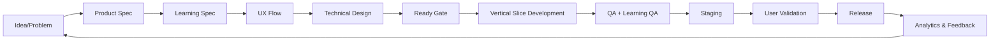

# Delivery Process

## Feature lifecycle

1. Product problem được ghi rõ.
2. Learning impact được phân tích nếu feature ảnh hưởng hành vi học.
3. UX flow + states được xác định.
4. Technical design chỉ làm sau khi behavior đủ rõ.
5. Backlog item phải qua Definition of Ready.
6. Dev làm vertical slice nhỏ nhất end-to-end.
7. QA kiểm tra business outcome, không chỉ endpoint.
8. Learning QA kiểm tra content/rules nếu liên quan.
9. Staging + acceptance.
10. Release + analytics.
11. Feedback có thể tạo discovery loop mới.

Không dùng mô hình “Backend xong toàn bộ → Frontend xong toàn bộ → QA cuối dự án”.
