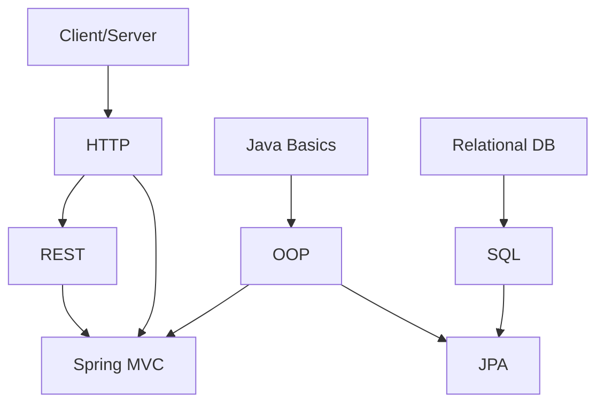

# Knowledge Graph Specification

## Node

`Concept`

Required fields:

- `id`
- `slug`
- `title`
- `summary`
- `difficulty`
- `domain`
- `status`
- `learningObjectives[]`

## Edge

`ConceptPrerequisite`

- `fromConceptId` = prerequisite
- `toConceptId` = dependent concept
- `strength` = REQUIRED | RECOMMENDED
- `reason`

## Example

## Planner semantics

- REQUIRED prerequisite weak → prioritize repair before assigning dependent concept as primary new content.
- RECOMMENDED prerequisite weak → planner may proceed with scaffold.
- User can preview any node.

## Data rule

Graph phải data-driven; không hard-code sequence trong React route/component.
