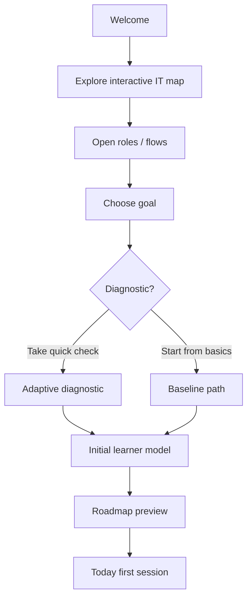

# Onboarding Flow

## Friction controls

- Explore cho phép skip nhưng khuyến khích novice xem mental model.
- Diagnostic optional.
- Không hỏi hàng loạt profile fields không cần cho planning.
- Chỉ cần availability ở mức đơn giản: minutes/session + days/week hoặc “decide each day”.

## First success moment

Trong session đầu, user phải hoàn thành một vòng nhỏ `learn → practice → check` thay vì chỉ setup profile.
