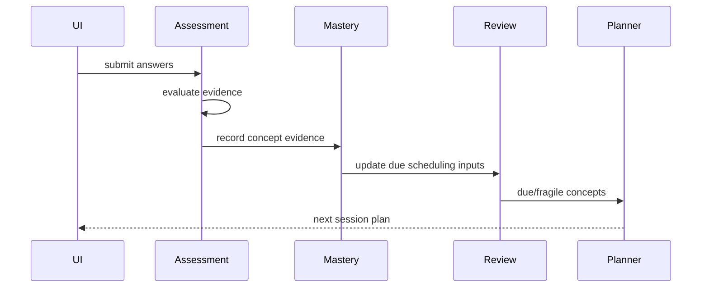

# Module Architecture

## Proposed backend modules

- `auth`
- `user`
- `explore`
- `career`
- `concept`
- `learningpath`
- `resource`
- `diagnostic`
- `planner`
- `session`
- `exercise`
- `assessment`
- `mastery`
- `review`
- `progress`
- `analytics`

## Dependency rule

Domain modules không được import persistence internals của module khác. Cross-module use case đi qua service/interface/query boundary rõ.

## Key flow

## Frontend feature areas

Mirror user capabilities, không mirror backend package một cách máy móc: `explore`, `onboarding`, `roadmap`, `today`, `learn`, `review`, `progress`, `auth`.
