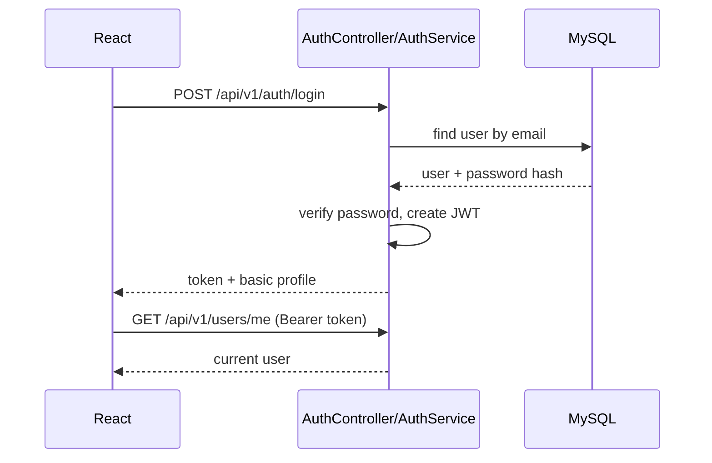
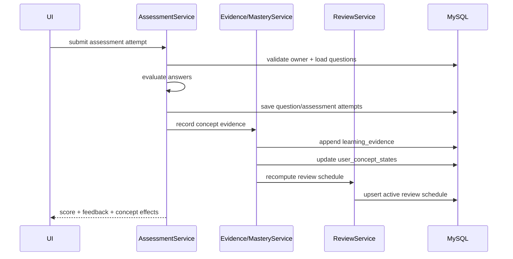
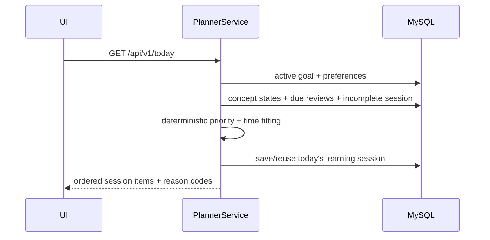

# Important Sequence Flows

These diagrams are intentionally simple so students can map them to controllers/services/tables.

## Login

## Assessment → evidence → mastery/review

## Today generation

## Missed-day recovery

No cron job is required in MVP. When learner returns, planner computes from current timestamps/state. The system does not create one missed task per calendar day.
