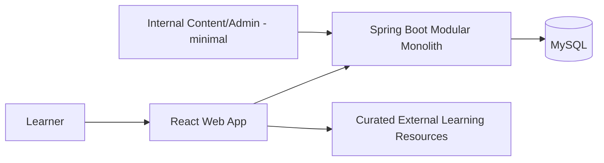

# System Context

## Baseline stack

- React + TypeScript.
- Spring Boot.
- MySQL.
- Flyway.
- REST/JSON under `/api/v1`.
- Docker Compose for reproducible local DB/integrated packaging.

## Architecture style

Modular monolith. One deployable backend, one web frontend, one relational database for MVP.

Modules separate responsibility in code but do not become network services.

## Why

- Simple enough for a student team to understand end-to-end.
- Transactions across assessment/evidence/mastery remain straightforward.
- Easier local development, testing and deployment.
- Can still separate modules cleanly for future extraction if evidence requires it.

## External resources

Official docs/articles are linked from the UI. MVP does not scrape/copy whole external sites into the database by default.

## Deployment

Provider is intentionally not hard-coded. Architecture must run locally and on a conventional web host/container platform without provider-specific domain logic.
